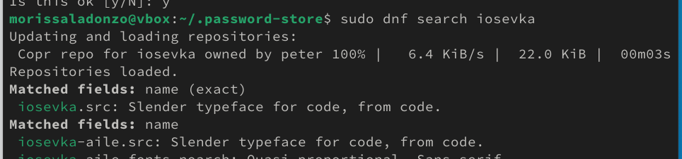

---
## Front matter
lang: ru-RU
title: Презентация по лабораторной работе №5
subtitle: Архиттектура компьютеров и операционные системы
author:
  - Мориссала Д.
institute:
  - Российский университет дружбы народов, Москва, Россия
date: 13 марта 2025

## i18n babel
babel-lang: russian
babel-otherlangs: english

## Formatting pdf
toc: false
toc-title: Содержание
slide_level: 2
aspectratio: 169
section-titles: true
theme: metropolis
header-includes:
 - \metroset{progressbar=frametitle,sectionpage=progressbar,numbering=fraction}
---

# Информация

## Докладчик

:::::::::::::: {.columns align=center}
::: {.column width="70%"}

  * Мориссала Донзо
  * НКАбд 01-24
  * Факультет физико-математический и естественных наук
  * Российский университет дружбы народов
  * [1032245982@rudn.ru](1032245982@rudn.ru)
  * <https://Morissala.github.io/>

:::
::: {.column width="30%"}
:::
::::::::::::::

# Цель работы

Цель данной работы -- настроика рабочей среды с помощью менеджера паролей pass и конфигурации chezmoi.

## Установка и Настройка Pass

С помощью командой dnf install через суперпользователя устанавливаю pass, pass-otp и gopass:

{#fig:001 width=70%}

## Установка и Настройка Pass

{#fig:002 width=70%}

## Установка и Настройка Pass

Создаю новый ключ GPG поскольку команда gpg --list-secret-keys ничего не выводила:

{#fig:003 width=70%}

## Установка и Настройка Pass

{#fig:004 width=70%}

## Установка и Настройка Pass

С помощью pass init, инициализирую хранилище указывая свой адрес электроной почты и создаю структуру git (pass git init) для синхронирования:

{#fig:005 width=70%}

## Установка и Настройка Pass

Перехожу в ~/.password-store для посмотра статуса синхронизации:

{#fig:006 width=70%}

## Настройка интерфейса с броузером

Добавляю плагин browserpass для firefox через броузера:

{#fig:007 width=70%}

## Настройка интерфейса с броузером

Для взаимодействия с броузером используется интерфейс native messaging. Поэтому кроме плагина к броузеру устанавливается программа, обеспечивающая интерфейс native messaging. Делаю это через терминала

{#fig:008 width=70%}

## Настройка интерфейса с броузером

{#fig:009 width=70%}

## Сохранение пароля

Добавляю новый пароль в файле, который будет использоваться для хранения пароля. Этот файл находится в каталоге, определяющее файловую структуру для вашего хранилища паролей.

{#fig:0010 width=70%}

## Сохранение пароля

При запуске pass BrowserPass/Passwords.txt, выводится запрос подтвердить созданный пароль:

{#fig:0012 width=70%}

## Сохранение пароля

Заменяю существующий пароль с помощью pass generate --in-place Passwords.txt

{#fig:0013 width=70%}

## Управление файлами конфигурации

### Дополнительное программное обеспечение

Устанавливаю дополнительное программное обеспечение:

{#fig:0014 width=70%}

### Дополнительное программное обеспечение

Установливаю шрифты iosevka. Для этого надо включть copr peterwu/iosevka и искать iosevka:

{#fig:0015 width=70%}

### Дополнительное программное обеспечение

{#fig:0016 width=70%}

### Дополнительное программное обеспечение

{#fig:0017 width=70%}

## Установка бинарного файла

Скрипт определяет архитектуру процессора и операционную систему и скачивает необходимый файл, поэтому я просто запускаю sh -c "$(wget -qO- chezmoi.io/get)":

{#fig:0018 width=70%}

## Создание собственного репозитория

С помощью утилита gh я создаю новый репозиторий dotfiles по шаблону yamadharma

{#fig:0019 width=70%}

## Подключение репозитория к своей системе

Сhezmoi является клоном репозитория dotfiles. Инициализирую его:

{#fig:0020 width=70%}

## Подключение репозитория к своей системе

Проверяю какие изменения внесёт chezmoi в домашний каталог, запуская chezmoi diff:

{#fig:0021 width=70%}

## Подключение репозитория к своей системе

Применяю изменения запускав chezmoi apply -v:

{#fig:0022 width=70%}

## Использование chezmoi на нескольких машинах

На другой машине я устанавливаю chezmoi

{#fig:0023 width=70%}

## Использование chezmoi на нескольких машинах

Далее инициализирую chezmoi со своём репозиторием dotfiles:

{#fig:0024 width=70%}

## Использование chezmoi на нескольких машинах

Проверяю какие изменения внесёт chezmoi в домашний каталог, запуская chezmoi diff:

{#fig:0025 width=70%}

## Использование chezmoi на нескольких машинах

Применяю изменения запускав chezmoi apply -v:

{#fig:0026 width=70%}

## Использование chezmoi на нескольких машинах

Меня устраивают изменения, внесённые chezmoi, поэтомму я просто обновляю chezmoi :

{#fig:0027 width=70%}

## Ежедневные операции c chezmoi

На моей основной машине я обновляю chezmoi на всякий случай:

{#fig:0028 width=70%}

## Ежедневные операции c chezmoi

Выполняю chezmoi git pull -- --autostash --rebase && chezmoi diff. Это запускается git pull --autostash --rebase в исходном каталоге, а chezmoi diff затем показывает разницу между целевым состоянием, вычисленным из исходного каталога, и фактическим состоянием.

{#fig:0029 width=70%}

## Ежедневные операции c chezmoi

Далее применяю "изменения":

{#fig:0030 width=70%}

## Ежедневные операции c chezmoi
Когда в исходный каталог вносятся изменения, chezmoi фиксирует изменения с помощью автоматически сгенерированного сообщения фиксации и отправляет их в репозиторий. Эта функция отключена по умолчанию но у меня уже была включено. Можно это увидеть в файле конфигурации ~/.config/chezmoi/chezmoi.toml:

{#fig:0031 width=70%}
