---
## Front matter
lang: ru-RU
title: Презентация по лабораторной работе №6
subtitle: Архиттектура компьютеров и операционные системы
author:
  - Мориссала Д.
institute:
  - Российский университет дружбы народов, Москва, Россия
date: 19 марта 2025

## i18n babel
babel-lang: russian
babel-otherlangs: english

## Formatting pdf
toc: false
toc-title: Содержание
slide_level: 2
aspectratio: 169
section-titles: true
theme: metropolis
header-includes:
 - \metroset{progressbar=frametitle,sectionpage=progressbar,numbering=fraction}
---

# Информация

## Докладчик

:::::::::::::: {.columns align=center}
::: {.column width="70%"}

  * Мориссала Донзо
  * НКАбд 01-24
  * Факультет физико-математический и естественных наук
  * Российский университет дружбы народов
  * [1032245982@rudn.ru](1032245982@rudn.ru)
  * <https://Morissala.github.io/>

:::
::: {.column width="30%"}
:::
::::::::::::::

## Определение полного имени домашнего каталога.

Для определения полного имени каталога я использую команду pwd. Выводится, что я в домашнем каталоге (home/mwakutaipa):

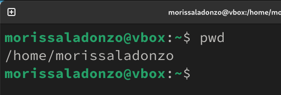{#fig:001 width=70%}

## Выполнение некоторых действиях.

Далее с помошью cd я перехожу в каталог /tmp и вывожу на экран содержимое каталога с помощью ls:

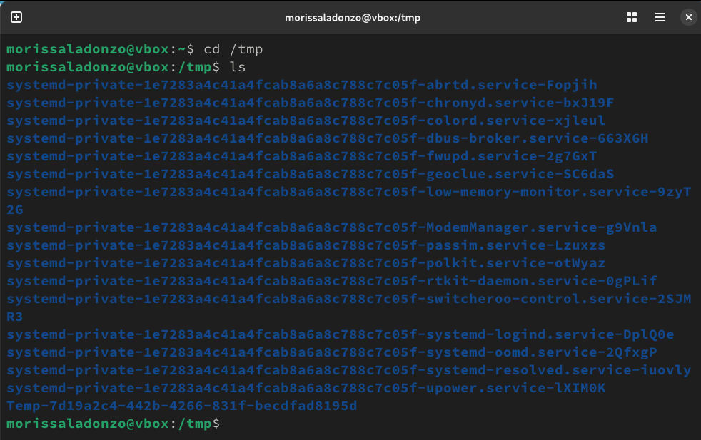{#fig:002 width=70%}

## Выполнение некоторых действиях.

Вывожу на экран содержимое каталога с помощью ls -l, чтобы вывести на экран подробную информацию о файлах и каталогах (тип файла, право доступа, число ссылок, владелец, размер, дата последней ревизии, имя файла или каталога.):

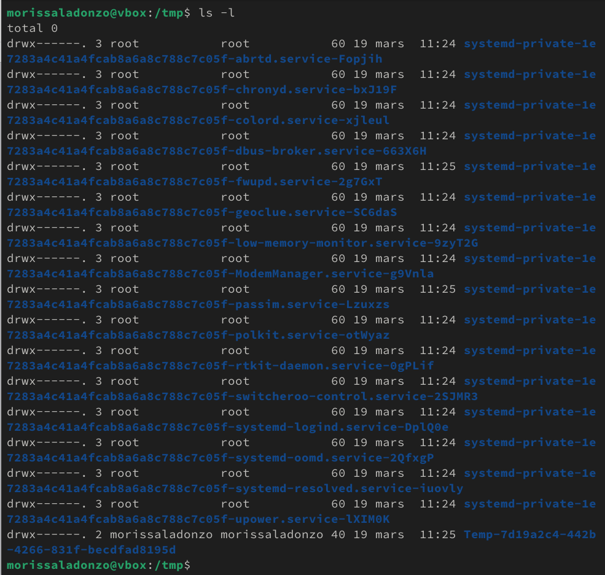{#fig:003 width=70%}

## Выполнение некоторых действиях.

ls -F, для получение информацию о типах файлов (каталог, исполняемый файл, ссылка)

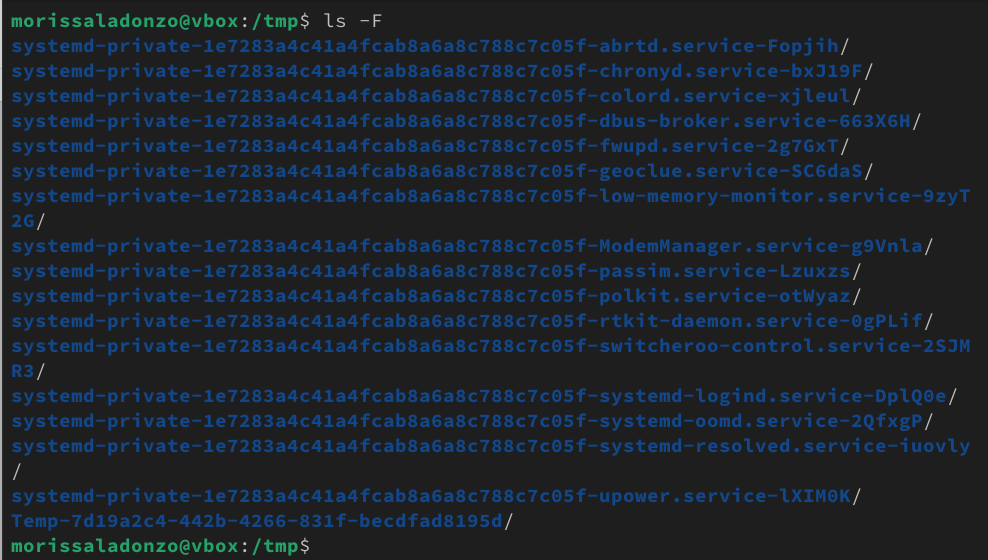{#fig:004 width=70%}

## Выполнение некоторых действиях.

ls -a, чтобы отобразить скрытых от просмотра файлов

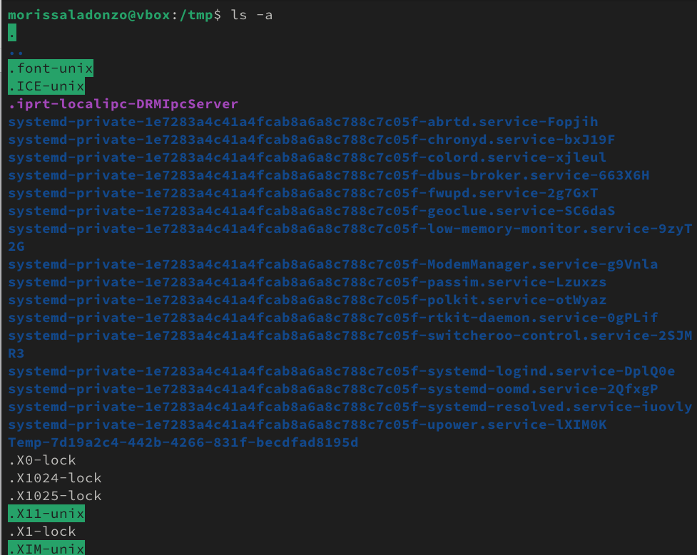{#fig:005 width=70%}

## Выполнение некоторых действиях.

Я перехожу в каталог /var/spool/ и вывожу на экран содержимое каталога с помощью ls. Вижу, что в нем есть подкаталог cron:

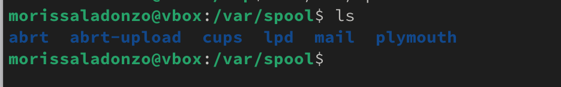{#fig:006 width=70%}

## Выполнение некоторых действиях.

Перехожу в домашний каталог и вывожу содержиемое с помощью ls -l. Видно, что mwakutaipa является владельцем файлов и подкаталогов: 

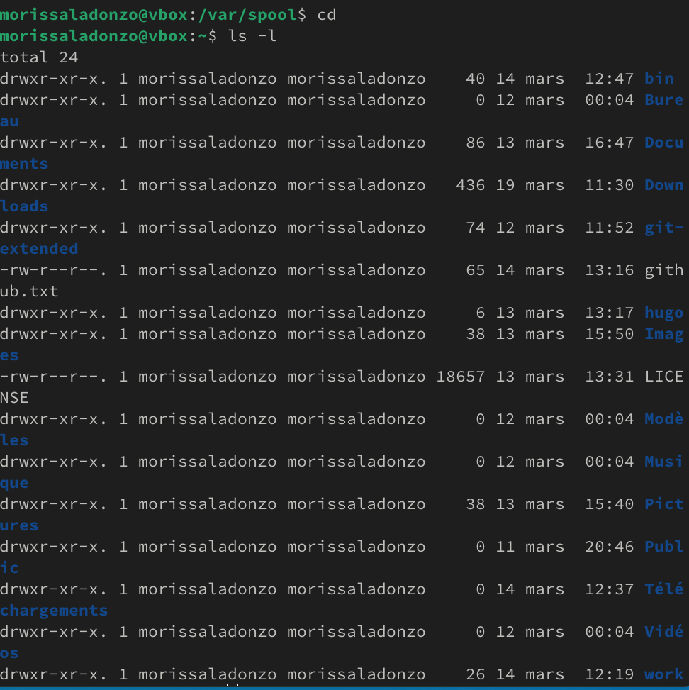{#fig:007 width=70%}

## Выполнение некоторых действиях.

В домашнем каталоге создаю новый каталог с именем newdir и в этом же каталоге создайте новый каталог с именем morefun одной командой. Далее использую ls, чтобы проверять:

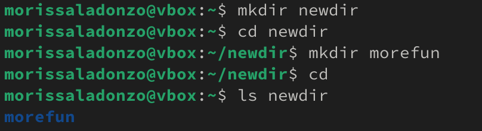{#fig:008 width=70%}

## Выполнение некоторых действиях.

Создаю одной командой еще три новых каталога с именами letters, memos, misk и проверяю создание:

{#fig:009 width=70%}

## Выполнение некоторых действиях.

Удаляю эти каталоги одной командой rmdir и проверяю:

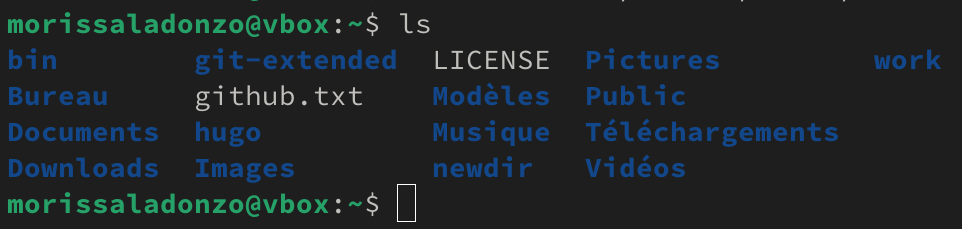{#fig:0010 width=70%}

## Выполнение некоторых действиях.

Удаляю каталог ~/newdir/morefun из домашнего каталога и проверяю, был ли каталог удалён:

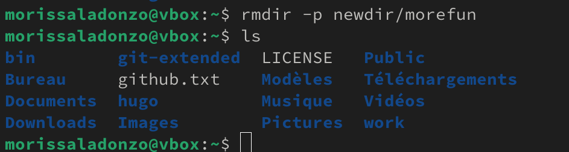{#fig:0011 width=70%}

## Определение опции команды с помощью man.

С помощью команды man определяю, какую опцию команды ls нужно использовать для просмотра содержимое не только указанного каталога, но и подкаталогов, входящих в него. Это является опцией -R:

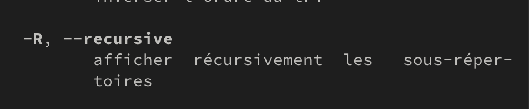{#fig:0012 width=70%}

## Определение опции команды с помощью man.

Определяю набор опций команды ls, позволяющий отсортировать по времени последнего изменения выводимый список содержимого каталога с развёрнутым описанием файлов. Это является опцией -с:

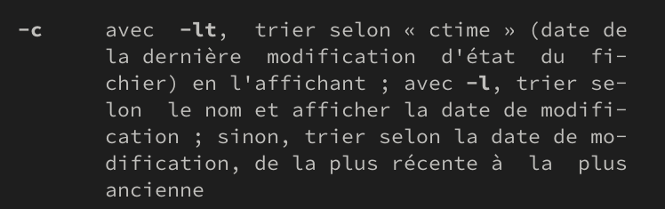{#fig:0013 width=70%}

## Определение опции команды с помощью man.

С помощью man cd, узнаю описание cd и ее опции. -L  переходить по символическим ссылкам после того, как обработаны все переходы. -P позволяет следовать по символическим ссылкам перед тем, как обработаны все переходы. -e позволяет выйти с ошибкой, если директория, в которую нужно перейти, не найдена.

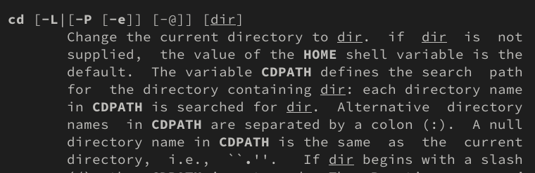{#fig:0014 width=70%}

## Определение опции команды с помощью man.

С помощью man pwd узнаю описание команду и ее опции. -L - брать директорию из переменной окружения. -P - отрасывать все символические ссылки. 

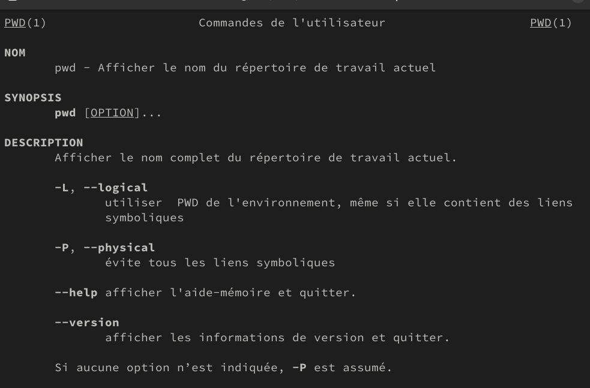{#fig:0015 width=70%}

## Определение опции команды с помощью man.

Описание опции mkdir: -m -- устанавливается права доступа.  -p -- рекурсивнно создать каталог и подкаталоги. -v -- сообшается о созданных директориях. -z -- устанавливается SELinux для создаваемой директории по умолчанию.

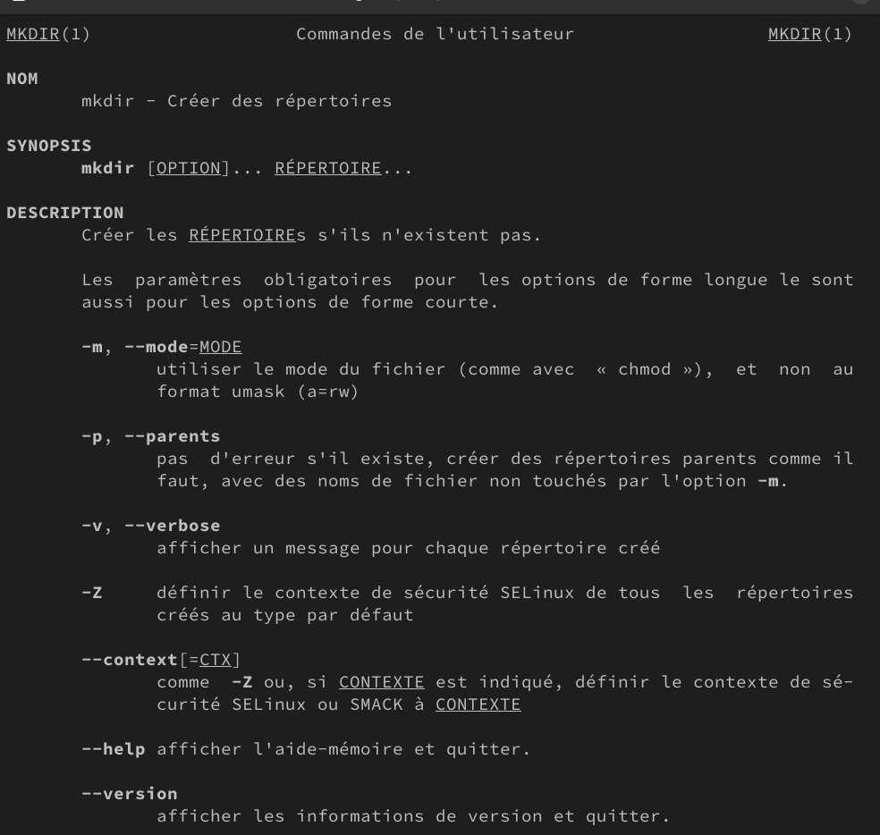{#fig:0016 width=70%}

## Определение опции команды с помощью man.

Описание опции rmdir: --ignore-fail-on-non-empty -- отмняет вывод ошибки если каталог не пустой. -p -- удалить рекурсивнно каталог и подкаталоги. -v -- выводить сообшение о каждом удаленный директории.

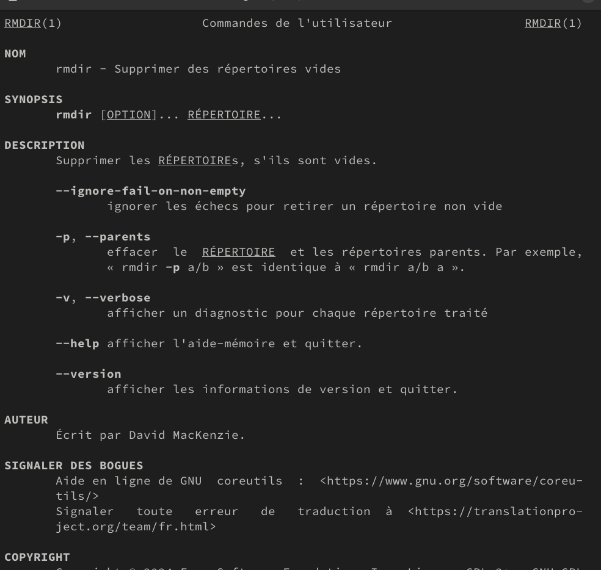{#fig:0017 width=70%}

## Определение опции команды с помощью man.

Описание опции rm: -f -- игнорировать несуществующие файлы и аргументы, не выводит запрос на подтверждение удаления. -i -- выводит запрос на подтверждение удаления  -I -- выводит один раз запрос на подтверждение удаления если удаление рекурсивнно или больше 3 раза

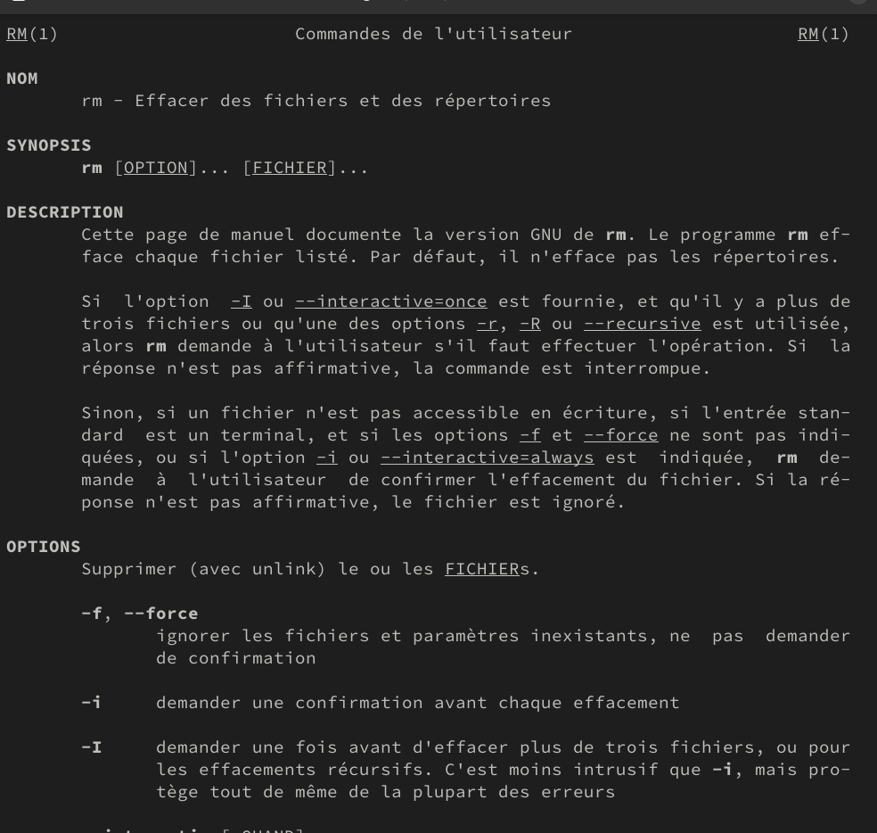{#fig:0018 width=70%}

## Использование команду history.

Используя информацию, полученную при помощи команды history: 

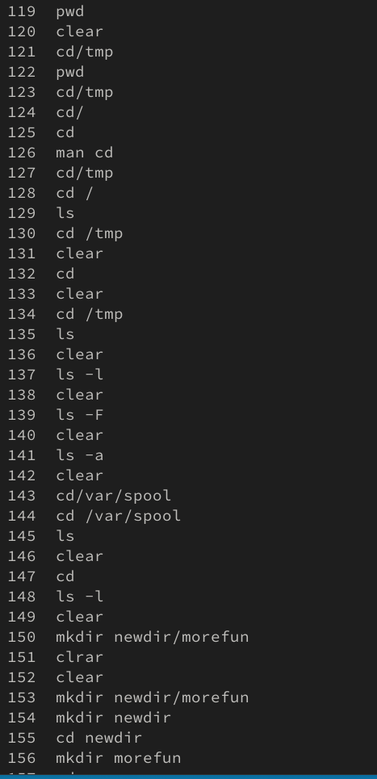{#fig:0019 width=70%}

## Использование команду history.

Выполняю модификацию и исполнение нескольких команд из буфера команд: 

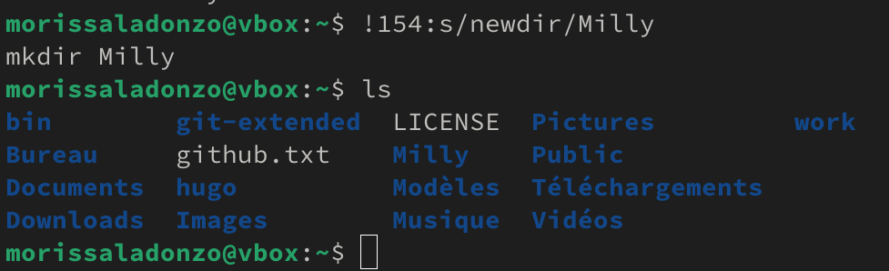{#fig:0021 width=70%}

# Выводы

При выполнении данной работы я приобретел практические навыки взаимодействия пользователя с системой по средством командной строки.
