---
## Front matter
lang: ru-RU
title: Презентация по второму этапу индивидуального проекта
subtitle: Архитектура компьютеров и операционные системы
author:
  - Мориссала Д.
institute:
  - Российский университет дружбы народов, Москва, Россия
date: 19 марта 2025

## i18n babel
babel-lang: russian
babel-otherlangs: english

## Formatting pdf
toc: false
toc-title: Содержание
slide_level: 2
aspectratio: 169
section-titles: true
theme: metropolis
header-includes:
 - \metroset{progressbar=frametitle,sectionpage=progressbar,numbering=fraction}
---

# Информация

## Докладчик

:::::::::::::: {.columns align=center}
::: {.column width="70%"}

  * Мориссала Донзо
  * НКАбд 01-24
  * Факультет физико-математический и естественных наук
  * Российский университет дружбы народов
  * [1032245982@rudn.ru](1032245982@rudn.ru)
  * <https://Morissala.github.io/>

:::
::: {.column width="30%"}
:::
::::::::::::::

# Цель работы

Изучение размещения посты на сайте.

# Задание

1. Добавлять данные:
   1. Разместить фотографию владельца сайта
   2. Разместить краткое описание владельца сайта
   3. Добавить информацию об интересах
   4. Добавить информацию об образовании
   
2. Сделать пост по прошедшей неделе
3. Сделать пост по теме "Управление версиями GIT" 

## Добавление данных

### Разместить фотографию владельца сайта

Я запускаю hugo в каталоге ~/work/blog/, чтобы начать создание сайта:

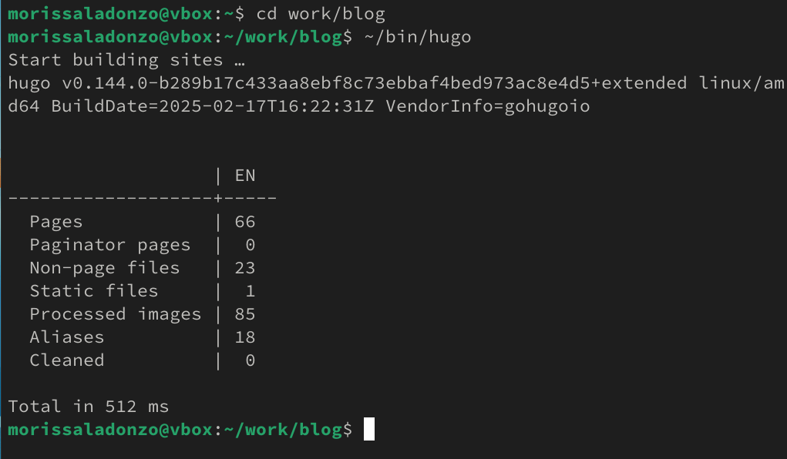{#fig:001 width=70%}

### Разместить фотографию владельца сайта

Запускаю hugo server, чтобы получить локальный хост-сайт, где я могу видеть вносимые мной изменения: 

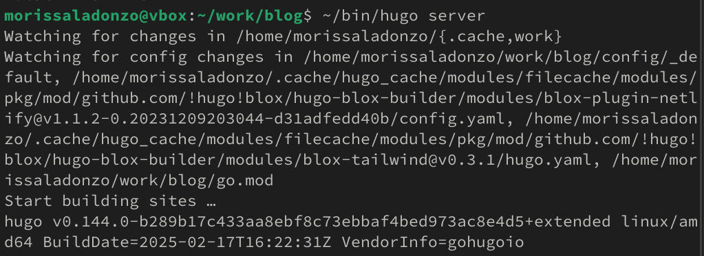{#fig:002 width=70%}

### Разместить фотографию владельца сайта

Для того, чтобы добавить фотографию на сайта я перехожу в каталог ~/work/blog/content/author:

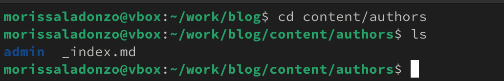{#fig:003 width=70%}

### Разместить фотографию владельца сайта

Заменяю avatar.jpg на свою фотографию и она устанавливается автоматический:

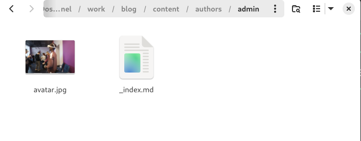{#fig:004 width=70%}

### Разместить краткое описание владельца сайта

Далее с помощью gedit я редактирую файл index.md, который ноходится в ~/work/blog/content/author и добавляю свою краткую биографию:

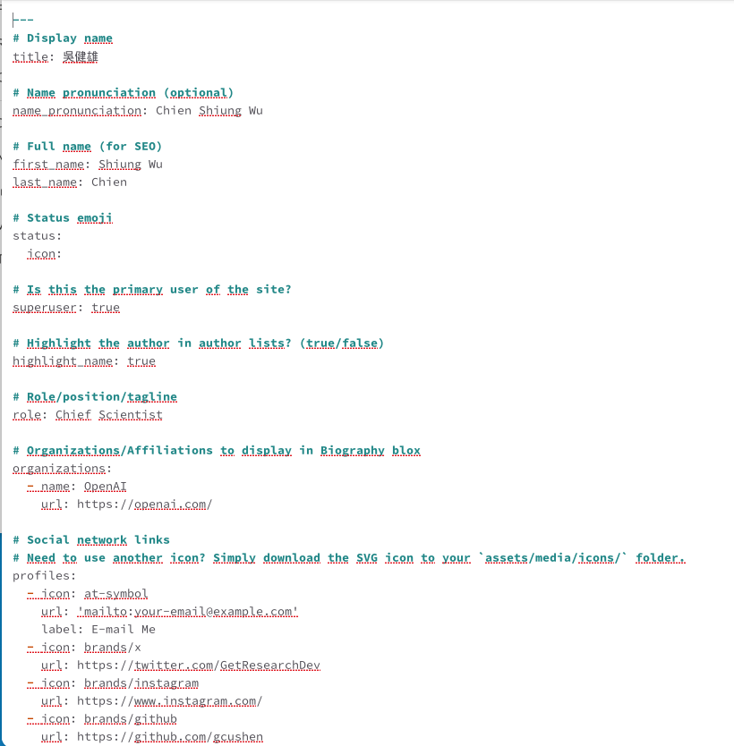{#fig:005 width=70%}

### Разместить краткое описание владельца сайта

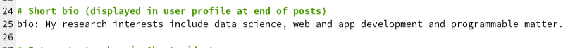{#fig:006 width=70%}

### Разместить краткое описание владельца сайта

Проверяю изменении на сайте:

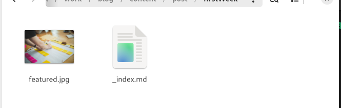{#fig:009 width=70%}

### Добавить информацию об интересах

Также изменяю информацию об интересах:

{#fig:007 width=70%}

### Добавить информацию об образовании

Также изменяю информацию об образовании:

{#fig:008 width=70%}

## Пост по прошедшей неделе

Я перехожу в катклог ~/work/blog/content/post и создаю новую папку. Создаю файл index.md и вставляю фотографию featured.jpg:

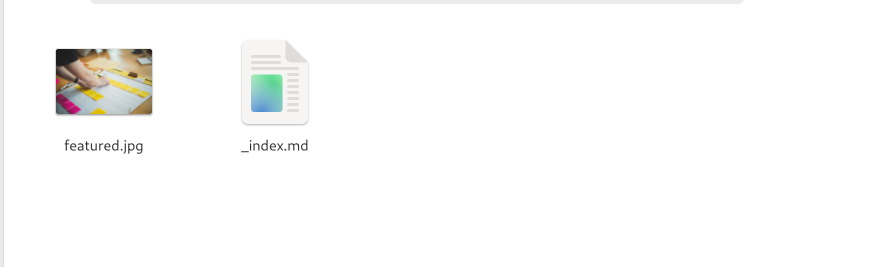{#fig:0010 width=70%}

## Пост по прошедшей неделе

Я редактирую файл и добавляю информацию по прошедшей неделе:

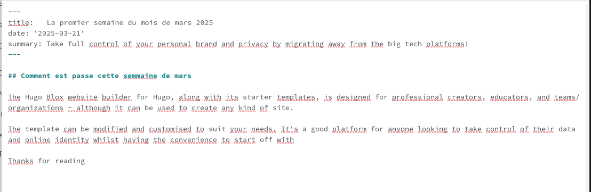{#fig:0011 width=70%}

## Пост по теме "Управление версиями GIT"

Создаю ещё одну новую папку в ~/work/blog/content/post. Создаю файл index.md и вставляю фотографию featured.jpg:

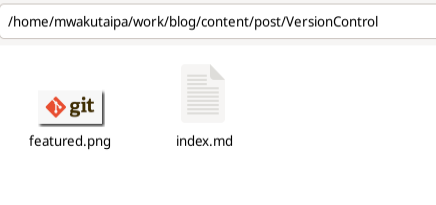{#fig:0012 width=70%}

## Пост по теме "Управление версиями GIT"

Я редактирую файл и добавляю информацию об управлении версиями GIT (Что это такое и как работает):

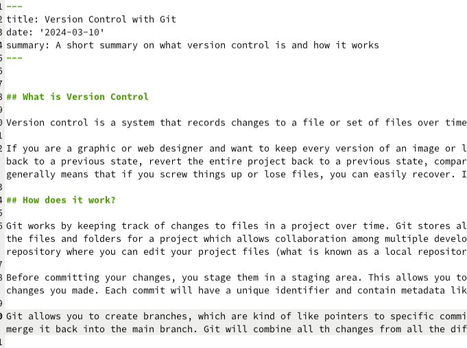{#fig:0013 width=70%}

## Пост по теме "Управление версиями GIT"

После сохранения изменении, я отправляю все на github:

{#fig:0014 width=70%}

# Выводы

При выполнении данной работы, я освоил размещение посты на сайте по шаблону hugo.
