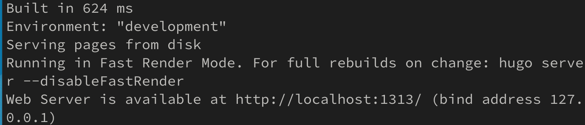
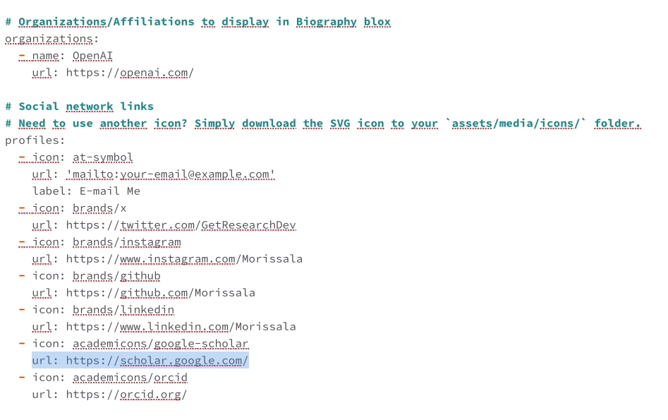
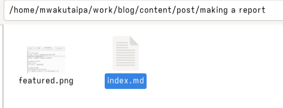

---
## Front matter
lang: ru-RU
title: Презентация по четвертому этапу проекта
subtitle: Добавление к сайту ссылок на научные и библиометрические ресурсы
author:
  - Мориссала Д.
institute:
  - Российский университет дружбы народов, Москва, Россия
date: 28 апреля 2025

## i18n babel
babel-lang: russian
babel-otherlangs: english

## Formatting pdf
toc: false
toc-title: Содержание
slide_level: 2
aspectratio: 169
section-titles: true
theme: metropolis
header-includes:
 - \metroset{progressbar=frametitle,sectionpage=progressbar,numbering=fraction}
 - '\makeatletter'
 - '\beamer@ignorenonframefalse'
 - '\makeatother'
---

# Информация

## Докладчик

:::::::::::::: {.columns align=center}
::: {.column width="70%"}

 * Мориссала Донзо
  * НКАбд 01-24
  * Факультет физико-математический и естественных наук
  * Российский университет дружбы народов
  * [1032245982@rudn.ru](1032245982@rudn.ru)
  * <https://Morissala.github.io/>

:::
::: {.column width="30%"}
:::
::::::::::::::

# Выполнение работы

## Разместить ссылки на научные и библиометрические ресурсы

Cоздал локальный сервер:

{#fig:001 width=70%}

## Разместить ссылки на научные и библиометрические ресурсы

В каталог ~/work/blog/content/admin редактировал файл _index.md (добавил ссылки):

{#fig:002 width=70%}

## Разместить ссылки на научные и библиометрические ресурсы

Проверил выполнение работы на локальном сервере: 

{#fig:003 width=70%}

# Добавить пост

## Добавить пост

каталог с файлом index.md и изображением:

{#fig:007 width=70%}

## Добавить пост

Я написал некоторый текст в index.md и сохранил файл:

{#fig:008 width=70%}

## Добавить пост

Проверил выполнение работы на локальном сервере. Затем я перенесла все изменений на в репозитории на github, чтобы изменения внести на общедоступном сайте:

{#fig:009 width=70%}

